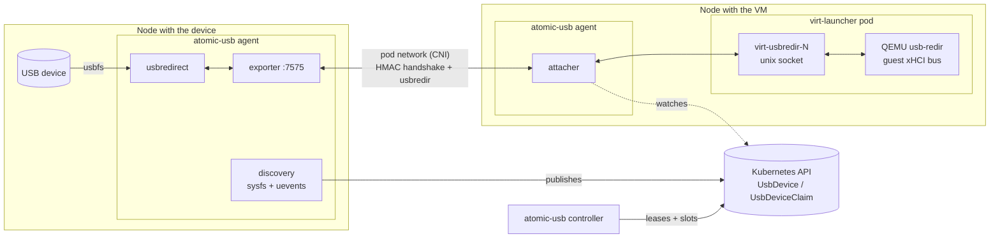
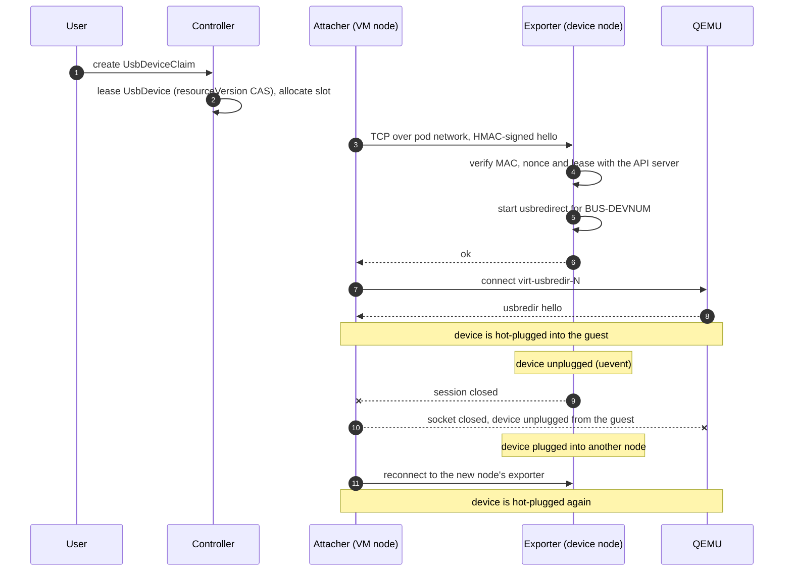
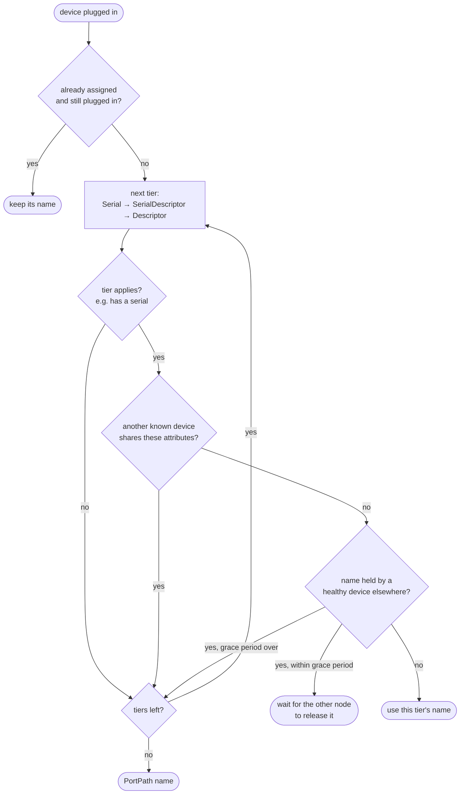
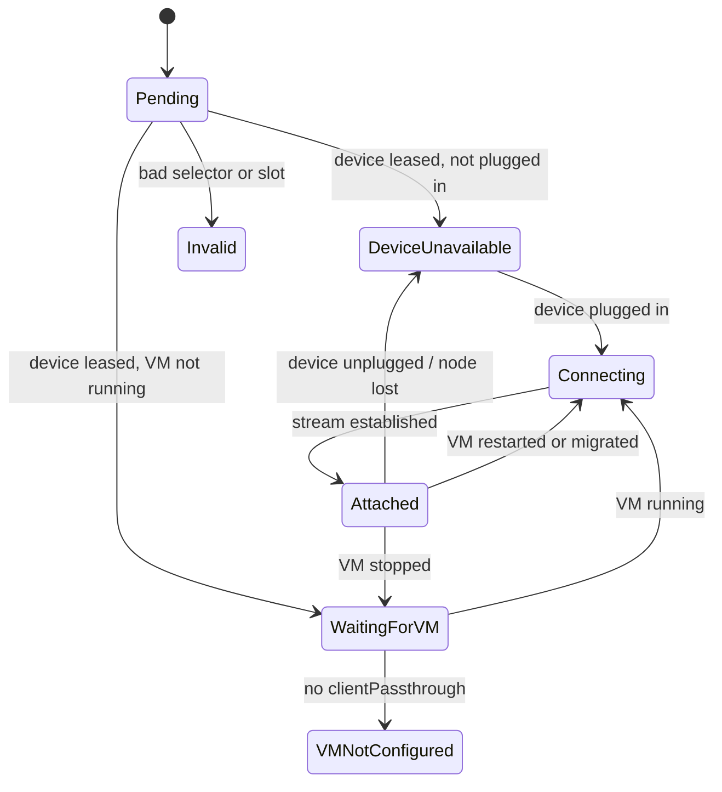

# kubevirt-atomic-usb

[](https://github.com/safewords/kubevirt-atomic-usb/actions/workflows/ci.yml)
[](https://github.com/safewords/kubevirt-atomic-usb/actions/workflows/release.yml)
[](https://github.com/safewords/kubevirt-atomic-usb/actions/workflows/chart.yml)
[](https://github.com/safewords/kubevirt-atomic-usb/releases)
[](https://github.com/safewords/kubevirt-atomic-usb/pkgs/container/kubevirt-atomic-usb)
[](charts/atomic-usb)
[](Cargo.toml)
[](https://kubevirt.io)
[](#license)

**atomic-usb** attaches USB devices plugged into **any** node of a Kubernetes cluster to
**KubeVirt VMs running on any other node**, over the pod network, with hotplug.

Plug a device into one node, run the VM on another, and the device shows up in the guest as a local
USB device. Move the device to a different node and it is re-attached automatically; restart or
live-migrate the VM and it comes back as well.

- **Atomic**: every device is leased to exactly one claim through a compare-and-swap on the API
  server, and carries at most one data-path session at any time.
- **Stable identities**: devices are tracked by serial number or other unique attributes, not by
  where they happen to be plugged in.
- **Hotplug everywhere**: plugging or unplugging on the host, creating or deleting a claim, and VM
  restarts or migrations are all reflected in the running guest.
- **No guest software, no host kernel modules**: uses QEMU's `usb-redir` devices that KubeVirt
  exposes through `clientPassthrough`, and `usbredirect` (libusb) on the device's node.

## How it works



1. The **agent** (DaemonSet) scans `/sys/bus/usb/devices`, reacts to kernel uevents, and publishes
   every device as a cluster-scoped `UsbDevice` with a heartbeat.
2. You create a namespaced **`UsbDeviceClaim`** that names a VM and selects a device.
3. The **controller** leases a matching device to the claim by writing `status.attachedTo` with a
   `resourceVersion` precondition, so two claims can never both win, and picks a usbredir slot.
4. The agent on **the VM's node** connects to the agent on **the device's node** over the pod
   network, and splices the stream onto the VM's `virt-usbredir-N` socket. QEMU plugs the device
   into the guest.



### Device identity

Each device is named after the most unique identity tier that is unambiguous in the cluster:

| Tier | Attributes | Follows the device across ports and nodes |
| --- | --- | --- |
| `Serial` | vendor id, product id, serial | yes |
| `SerialDescriptor` | + `bcdDevice`, manufacturer and product strings (clones with duplicate serials) | yes |
| `Descriptor` | vendor id, product id, `bcdDevice`, strings (no serial) | yes, while no identical device exists |
| `PortPath` | node + physical port path | no |



A tier is skipped when another known device shares its attributes, so two identical devices without
serial numbers never get mixed up; both fall back to port identities. Assignments are sticky while
a device stays plugged in, so a lookalike appearing later never renames a device that is attached.
When a device moves, the new node waits for the old node to release the identity (or for its
heartbeat to expire) instead of inventing a new name.

```console
$ kubectl get usbdevices
NAME                                VENDOR   PRODUCT   DESCRIPTION   IDENTITY     NODE       PHASE       CLAIM
usb-0781-5581-4c530001234567891234  0781     5581      Ultra         Serial       worker-1   Available   my-device
usb-1a86-7523-usb-serial-0a1b2c3d   1a86     7523      USB Serial    Descriptor   worker-2   Available
```

## Requirements

- KubeVirt, with VMs that set `spec.template.spec.domain.devices.clientPassthrough: {}`.
- Pod-to-pod connectivity between nodes on TCP port 7575.
- Linux nodes with `/dev/bus/usb`; privileged agent pods.
- The image ships `usbredirect` from usbredir 0.15. Versions before 0.14 select devices by
  vendor:product and can pick the wrong one of two identical devices.

## Install

```sh
kubectl create namespace atomic-usb
kubectl label namespace atomic-usb pod-security.kubernetes.io/enforce=privileged

helm install atomic-usb oci://ghcr.io/safewords/charts/atomic-usb --namespace atomic-usb
```

or from the Helm repository:

```sh
helm repo add atomic-usb https://raw.githubusercontent.com/safewords/kubevirt-atomic-usb/gh-pages
helm install atomic-usb atomic-usb/atomic-usb --namespace atomic-usb
```

The controller generates the pre-shared key secret on first start and the agents start once it
exists. See the [chart README](charts/atomic-usb/README.md) for all values, e.g. a non-default
kubelet root directory or devices that should never be published.

## Usage

Enable usbredir sockets on the VM (takes effect after a restart):

```yaml
spec:
  template:
    spec:
      domain:
        devices:
          clientPassthrough: {}
```

Claim a device:

```yaml
apiVersion: atomicusb.safewords.io/v1alpha1
kind: UsbDeviceClaim
metadata:
  name: my-device
  namespace: default
spec:
  vmName: my-vm
  selector:              # all given fields must match
    vendorId: "0781"
    productId: "5581"
    serial: "4C530001234567891234"
    # deviceName: usb-0781-5581-4c530001234567891234
    # product: "Ultra"
    # node: worker-1
    # portPath: "1-2"
  # slot: 3              # optional, 0-3
```

```console
$ kubectl get usbclaim
NAME        VM      PHASE      DEVICE                               DEVICE-NODE   VM-NODE    AGE
my-device   my-vm   Attached   usb-0781-5581-4c530001234567891234   worker-1      worker-3   2m
```



| Phase | Meaning |
| --- | --- |
| `Pending` | no free device matches the selector |
| `DeviceUnavailable` | the leased device is unplugged, or its node stopped heartbeating (`Lost`) |
| `WaitingForVM` | the VM does not exist or is not running |
| `VMNotConfigured` | the VM lacks `devices.clientPassthrough` |
| `Connecting` | the data path is being set up (details in `.status.connection.message`) |
| `Attached` | the device is plugged into the guest |
| `Invalid` | the claim is malformed or its slot is taken (details in `.status.message`) |

Deleting the claim detaches the device from the guest and releases the lease. Selectors that match
several devices (e.g. only `vendorId` and `productId`) lease one of them; if it becomes unavailable
while another matching device is free, the claim moves to that one. See [`examples/`](examples/)
for a test VM and claims.

## Operational notes

- **Slots**: KubeVirt creates four usbredir sockets per VM. atomic-usb allocates them from 3
  downwards, `virtctl usbredir` from 0 upwards; running both against the same VM can still collide.
  Pin `spec.slot` if needed.
- **Restarts**: restarting an agent ends the sessions it carries, which the guest sees as a short
  unplug and replug. Attached devices are unaffected by controller restarts or outages.
- **Live migration**: VMs with `clientPassthrough` remain live-migratable; the agent on the target
  node takes over after the migration and the guest sees a brief replug.
- **Node failure**: TCP keepalives detach devices from a dead peer within about a minute; devices
  on a node whose agent stops heartbeating are marked `Lost` after 90 seconds.
- **Security**: the handshake is authenticated (HMAC-SHA256 with timestamp and nonce) and the
  exporter checks the lease with the API server, but USB traffic itself is not encrypted. Use a CNI
  with transparent encryption if the pod network is not trusted, and restrict who may create
  `UsbDeviceClaim`s: a claim gives a VM full access to a device.
- **Latency**: USB is carried over TCP. Serial adapters, HID devices, smart cards and mass storage
  work well; isochronous devices such as webcams and audio interfaces need a fast, quiet network.

## Troubleshooting

```sh
kubectl get usbdevices -o wide                              # what the agents see and who holds it
kubectl -n <ns> get usbclaim <name> -o yaml                 # .status.message, .status.connection
kubectl -n atomic-usb logs <agent pod on the device's or VM's node>
kubectl -n atomic-usb logs deploy/atomic-usb-controller
kubectl -n atomic-usb exec <agent pod> -- atomic-usb scan   # identities the agent would assign

# What QEMU has plugged into the guest:
kubectl -n <ns> exec <virt-launcher pod> -c compute -- virsh qemu-monitor-command <ns>_<vm> --hmp 'info usb'
```

## Development

```sh
cargo test                                          # Linux: uses fake sysfs trees and unix sockets
cargo run -- crds > charts/atomic-usb/crds/crds.yaml
cargo run -- scan                                   # identities for this machine's devices
docker build -t atomic-usb .
```

| Module | Purpose |
| --- | --- |
| `src/identity.rs` | identity tiers and assignment |
| `src/sysfs.rs`, `src/uevent.rs` | device discovery and hotplug events |
| `src/proto.rs` | exporter handshake (HMAC, replay protection) |
| `src/agent/discovery.rs` | publishing `UsbDevice` objects |
| `src/agent/exporter.rs` | device side of the data path (`usbredirect`) |
| `src/agent/attacher.rs` | VM side of the data path (QEMU usbredir sockets) |
| `src/launcher.rs` | locating and connecting to `virt-usbredir-N` sockets |
| `src/controller.rs` | leases, slots, claim phases, lost-device detection |
| `src/crd.rs` | custom resource definitions |

### Releases

- Application: push a `vX.Y.Z` tag. CI builds amd64 and arm64 binaries, publishes
  `ghcr.io/safewords/kubevirt-atomic-usb:X.Y.Z` and creates a GitHub release.
- Helm chart: bump `version` (and `appVersion`) in `charts/atomic-usb/Chart.yaml` and merge to
  `main`. CI publishes it to the Helm repository and to `oci://ghcr.io/safewords/charts/atomic-usb`.

## License

Licensed under either of

- Apache License, Version 2.0 ([LICENSE-APACHE](LICENSE-APACHE))
- MIT license ([LICENSE-MIT](LICENSE-MIT))

at your option.

Unless you explicitly state otherwise, any contribution intentionally submitted for inclusion in this
project by you, as defined in the Apache-2.0 license, shall be dual licensed as above, without any
additional terms or conditions.
