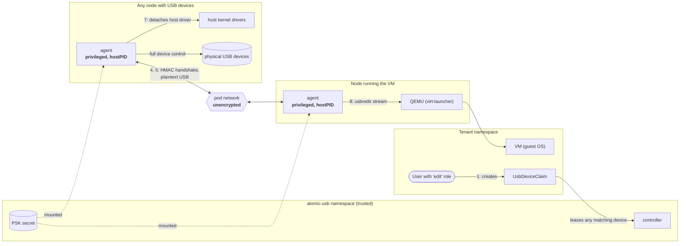

# Security

> [!CAUTION]
> **atomic-usb deliberately punches holes through isolation boundaries.** It runs a privileged agent
> with host access on every node, and it lets whoever can create a `UsbDeviceClaim` take control of
> physical USB devices on any node in the cluster. USB traffic crosses the pod network unencrypted.
> Treat it as node-level infrastructure, not as a tenant workload. Do not install it on a shared or
> multi-tenant cluster without applying the [hardening checklist](#hardening-checklist).

## Reporting a vulnerability

Please report vulnerabilities privately through
[GitHub private vulnerability reporting](https://github.com/safewords/kubevirt-atomic-usb/security/advisories/new),
not in public issues.

## Summary of implications

| # | Implication | Severity | Mitigation |
| --- | --- | --- | --- |
| 1 | Creating a `UsbDeviceClaim` grants full control of a physical device on any node | High | Restrict who can create claims |
| 2 | The agent is equivalent to root on every node | High | Trust the image and namespace like the kubelet |
| 3 | Compromising one node compromises every VM with an attached device | High | Node hardening; limit where agents run |
| 4 | USB traffic is unencrypted on the pod network | High on untrusted networks | CNI encryption |
| 5 | The pre-shared key unlocks every attached device | High | Protect the secret; NetworkPolicy |
| 6 | Device identities are not authentication | Medium | Physical security; precise selectors |
| 7 | Attaching a device takes it away from the host | Medium | `agent.ignore` for host-critical devices |
| 8 | Guest ↔ host USB attack surface | Medium | Only attach devices to trusted VMs |
| 9 | Agents and controller read every VMI, including inline cloud-init data | Medium | Keep secrets out of inline cloud-init |
| 10 | Denial of service by claim squatting or connection floods | Low–Medium | Admission policy; NetworkPolicy |
| 11 | Device inventory (serial numbers, locations) is visible cluster-wide | Low | RBAC on `usbdevices` |

## Trust boundaries



## Details

### 1. Claims grant physical device access

A `UsbDeviceClaim` in *any* namespace can lease *any* published device on *any* node that is not
already leased. The guest receives raw USB access: it can read and write mass storage, capture or
inject keystrokes (HID), use security keys and smart cards, talk to serial consoles and UPS units,
reach the network through USB network adapters (bypassing NetworkPolicy), and flash device firmware.

- The Helm chart aggregates `UsbDeviceClaim` permissions into the built-in `admin` and `edit`
  roles by default (`rbac.aggregateToDefaultRoles: true`). **Every namespace editor can therefore
  take devices from every node.** Disable this on shared clusters.
- Selectors are not scoped to a namespace or a node. A selector that only names `vendorId` and
  `productId` takes the first free matching device anywhere.
- There is no built-in allowlist of which namespaces may use which devices. Use an admission policy
  (see the [checklist](#hardening-checklist)). Note that such a policy cannot look up `UsbDevice`
  objects, so vendor restrictions in a claim selector can be bypassed with `deviceName`; use
  `agent.ignore` to keep devices out of reach entirely.

### 2. The agent is root on every node

The agent DaemonSet runs `privileged: true` with `hostPID: true` and host mounts of `/dev/bus/usb`,
`/run/udev` and the kubelet pod directory. Anyone who controls the agent image, its pods, or the
`atomic-usb` namespace controls every node:

- A privileged container can trivially escape to the host.
- The read-only kubelet pod directory exposes the volumes of every pod on the node, including
  mounted Secrets and service account tokens.
- `hostPID` exposes all processes and, through `/proc/<pid>/root`, the filesystems of all
  containers on the node.

Only allow cluster administrators to write to the `atomic-usb` namespace, pin the image by digest,
and review upgrades like you would a CNI or CSI driver. Set `agent.hostPID=false` when
`agent.kubeletRoot` is correct for your distribution; it is only needed as a fallback for locating
QEMU's sockets.

### 3. One compromised node reaches every attached VM

The agent's RBAC is cluster-wide: every agent may create and update any `UsbDevice`. A compromised
node can publish a forged device under the identity of a real one, or claim that a leased device
"moved" to it, and the claim follows. The VM then receives a USB device controlled by the attacker
(for example a fake keyboard that types commands, or malicious storage). The agent on the VM's node
also connects QEMU to whatever exporter the `UsbDevice` status names.

The blast radius of a node compromise therefore extends to **every VM with an attached device**,
not only to VMs on that node.

### 4. USB traffic is not encrypted

After the handshake, USB traffic flows in plaintext over TCP between agent pods. Anyone who can
observe the pod network (a compromised node, a shared L2 segment, an unencrypted overlay between
sites) can read everything the device sends and receives: disk contents, keystrokes, serial data.
Anyone who can actively intercept it can inject traffic in both directions, since the stream is not
integrity-protected after the handshake.

Use a CNI with transparent encryption (WireGuard or IPsec) whenever the node network is not fully
trusted.

### 5. The pre-shared key is a master key

Agents authenticate to each other with HMAC-SHA256 over a cluster-wide pre-shared key (secret
`<release>-psk`), a timestamp (±120 s) and a nonce. The exporter additionally checks with the API
server that the requested device is leased to the claim named in the handshake.

Anyone who has the key and can reach port 7575 can impersonate the attaching agent of any
**currently leased** claim (claim names and UIDs are not secret) and take over the device from the
real VM. The key is readable by the agent pods, by anyone who can read secrets in the
`atomic-usb` namespace, and by anyone with root on any node.

Further limitations:

- Replay protection is kept in memory per agent; a captured handshake can be replayed within the
  skew window against an agent that restarted or that received the device after a move.
- Rotating the key: replace the secret; agents re-read it on every handshake, so new sessions use
  the new key within the kubelet's secret sync period while in-flight sessions continue.

### 6. Device identities are not authentication

Serial numbers, descriptor strings and port paths are chosen by the device and trivially spoofed.
Anyone with physical access to *any* node can plug in a device that claims the identity of a leased
device while the real one is unplugged, and it will be attached to the claiming VM. Serial-less
devices identified by descriptor are even easier to impersonate. Identities exist for convenience,
not for security.

### 7. Attaching a device takes it away from the host

To redirect a device, `usbredirect` detaches the host's kernel drivers. Claiming a USB network
adapter, a USB boot or data disk, a console keyboard, a UPS monitored by the host, or a Bluetooth
controller in use breaks that function on the node, possibly taking the node offline. Hubs are never
published; every other device is. List host-critical devices in `agent.ignore`.

### 8. Guest ↔ host USB attack surface

- A malicious guest (or anyone who can speak the handshake) drives `usbredirect`, libusb and the
  host kernel's usbfs on the **device's node**, inside a privileged container. A parser or driver
  bug there is a path from a VM to root on that node.
- Whoever controls the exporter side drives QEMU's `usb-redir` device in the **VM's**
  virt-launcher pod.
- A guest can reflash the firmware of a device that supports firmware updates, turning it into a
  malicious device that persists when it is later plugged into another machine.

Only attach devices to VMs you trust with those devices, and do not share re-flashable devices
between tenants.

### 9. VMI read access

Agents and the controller list and watch `VirtualMachineInstance` objects in all namespaces. VMI
specs contain inline cloud-init `userData`, which often includes passwords or SSH keys. Prefer
`userDataSecretRef` / `networkDataSecretRef` for secrets.

### 10. Denial of service

- **Claim squatting**: a lease is held as long as the claim exists, even when its VM does not.
  Anyone who can create claims can reserve every free device.
- **Connection floods**: the exporter port accepts connections from any pod by default and holds
  unauthenticated connections for up to 10 seconds; there is no connection limit.
- **Host impact**: see [7](#7-attaching-a-device-takes-it-away-from-the-host).

### 11. Inventory disclosure

`UsbDevice` objects are cluster-scoped and include serial numbers, product strings, node names,
port paths and agent pod IPs. The chart does not grant read access to them to regular users; keep it
that way if device serials (for example of security keys) are sensitive.

## Hardening checklist

- [ ] **Restrict who can create claims.** Install with `--set rbac.aggregateToDefaultRoles=false`
      and grant `usbdeviceclaims` explicitly to the few users or namespaces that need devices.
- [ ] **Enforce claim policy with admission control** (Kubernetes 1.30+). This example only allows
      claims in labeled namespaces and only for specific devices:

  ```yaml
  apiVersion: admissionregistration.k8s.io/v1
  kind: ValidatingAdmissionPolicy
  metadata:
    name: atomic-usb-claims
  spec:
    failurePolicy: Fail
    matchConstraints:
      resourceRules:
        - apiGroups: ["atomicusb.safewords.io"]
          apiVersions: ["*"]
          operations: ["CREATE", "UPDATE"]
          resources: ["usbdeviceclaims"]
    validations:
      - expression: >-
          has(namespaceObject.metadata.labels) &&
          'atomicusb.safewords.io/claims-allowed' in namespaceObject.metadata.labels &&
          namespaceObject.metadata.labels['atomicusb.safewords.io/claims-allowed'] == 'true'
        message: "UsbDeviceClaims are only allowed in namespaces labeled atomicusb.safewords.io/claims-allowed=true"
      - expression: "has(object.spec.selector.deviceName) || has(object.spec.selector.serial)"
        message: "UsbDeviceClaims must select a specific device by deviceName or serial"
  ---
  apiVersion: admissionregistration.k8s.io/v1
  kind: ValidatingAdmissionPolicyBinding
  metadata:
    name: atomic-usb-claims
  spec:
    policyName: atomic-usb-claims
    validationActions: ["Deny"]
  ```

- [ ] **Keep host-critical devices out of reach** with `agent.ignore` (e.g. USB NICs, boot disks,
      UPS units, keyboards): `--set-json 'agent.ignore=["0bda:8153","abcd:*"]'`.
- [ ] **Encrypt the pod network** (WireGuard or IPsec in your CNI).
- [ ] **Restrict the exporter port to agents** with a NetworkPolicy (requires a CNI that enforces
      NetworkPolicy; kubelet readiness probes from the node must still be allowed, which is the
      default for common CNIs):

  ```yaml
  apiVersion: networking.k8s.io/v1
  kind: NetworkPolicy
  metadata:
    name: atomic-usb-agent
    namespace: atomic-usb
  spec:
    podSelector:
      matchLabels:
        app.kubernetes.io/name: atomic-usb
        app.kubernetes.io/component: agent
    policyTypes: ["Ingress"]
    ingress:
      - from:
          - podSelector:
              matchLabels:
                app.kubernetes.io/name: atomic-usb
                app.kubernetes.io/component: agent
        ports:
          - protocol: TCP
            port: 7575
  ```

- [ ] **Treat the `atomic-usb` namespace as privileged infrastructure**: only cluster
      administrators may create pods, read secrets or change workloads there.
- [ ] **Pin the image by digest** instead of a mutable tag.
- [ ] **Disable `agent.hostPID`** when the kubelet root directory is configured correctly.
- [ ] **Protect and rotate the pre-shared key** (`<release>-psk`).
- [ ] **Keep secrets out of inline cloud-init** in VMs (`userDataSecretRef`).
- [ ] **Physically secure nodes**: physical access to any node allows impersonating devices.

## Known limitations and planned hardening

- No per-namespace device allowlist in the API; enforcement relies on RBAC, admission policy and
  `agent.ignore`.
- No transport encryption or channel binding in the protocol itself (planned: TLS with
  per-agent certificates).
- Agent RBAC is not node-scoped; a node can modify devices of other nodes (planned: admission policy
  using the node name bound to the agent's service account token).
- The exporter has no connection limit or rate limiting.
- `usbredirect` runs inside the privileged agent container rather than in a sandbox with access to
  only the one device node.
- Container images are not signed and no SBOM is published yet.
